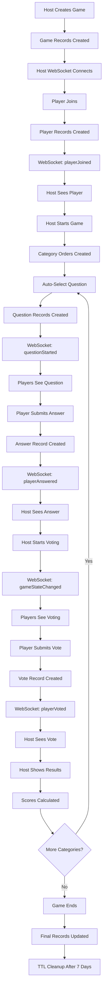

# Game Flow and Database Operations

## Overview

This document maps the complete game lifecycle from creation to completion, detailing every database operation, state change, and WebSocket communication.

## 🎮 **Game States Overview**

### Host States
- `LOBBY` - Game created, waiting for players
- `ASK/Q001` - Displaying question Q001 to players
- `VOTE/Q001` - Players voting on answers for Q001
- `RESULTS/Q001` - Showing results for Q001
- `END` - Game completed

### Player States
- `JOINED` - Player joined, waiting for questions
- `ANSWERED/Q001` - Player answered question Q001
- `VOTED/Q001` - Player voted on question Q001
- `QUIT` - Player left the game

## 📊 **Database Schema Overview**

```mermaid
erDiagram
    GAMES {
        string PK "GAMES"
        string SK "GAME#3001"
        string Title
        string CreatedAt
        string HostName
        string GameType
        string QuestionSetId
        number ttl
    }


    GAME_STATE {
        string PK "GAME#3001"
        string SK "STATE"
        string HostState "LOBBY|ASK/Q001|VOTE/Q001|RESULTS/Q001|END"
        string CurrentQuestionId
        array PlayedQuestions
        boolean GameStarted
        number ttl
    }

    CATEGORY_STATE {
        string PK "GAME#3001"
        string SK "STATE#CATS"
        string HostMask1_8 "00000011"
        string AvailMask1_8 "00000011"
        array SelectedCategories
        number ttl
    }

    CATEGORY_ORDER {
        string PK "GAME#3001"
        string SK "CAT#001#ORDER"
        number CategoryNumber
        string CategoryName
        boolean IsRandom
        array QuestionOrder
        number TotalQuestions
        number ttl
    }

    CATEGORY_ACTIVE {
        string PK "GAME#3001"
        string SK "CAT#001#ACTIVE"
        number CategoryNumber
        number ActiveIndex
        number QuestionsUsed
        number RemainingQuestions
        string CompletedAt
        number ttl
    }

    PLAYERS {
        string PK "GAME#3001"
        string SK "PLAYER#Alice"
        string PlayerName
        string JoinedAt
        number TotalScore
        number CurrentRank
        boolean IsActive
        number ttl
    }

    PLAYER_STATE {
        string PK "GAME#3001"
        string SK "PLAYER#Alice#STATE"
        string CurrentState "JOINED|ANSWERED/Q001|VOTED/Q001|QUIT"
        array AnsweredQuestions
        array VotedQuestions
        number TotalScore
        string LastSeenAt
        number ttl
    }

    QUESTIONS {
        string PK "GAME#3001"
        string SK "QUESTION#001#LOOKUP"
        string SetId
        string QuestionRef "QUESTION#c001#001"
        string Category
        string StartedAt
        boolean AutoSelected
        number ttl
    }

    ANSWERS {
        string PK "GAME#3001"
        string SK "QUESTION#001#ANSWER#Alice"
        string PlayerName
        string QuestionId
        string Answer
        string SubmittedAt
        number ttl
    }

    VOTES {
        string PK "GAME#3001"
        string SK "QUESTION#001#VOTES#Alice"
        string PlayerName
        string QuestionId
        string FirstChoice
        string SecondChoice
        string ThirdChoice
        string SubmittedAt
        number ttl
    }

    RESULTS {
        string PK "GAME#3001"
        string SK "QUESTION#001#RESULTS#Alice"
        string PlayerName
        string QuestionId
        number Score
        number Rank
        string CalculatedAt
        number ttl
    }

    CONNECTIONS {
        string PK "GAME#3001"
        string SK "CONNECTION#abc123"
        string ConnectionId
        string GameId
        string PlayerName
        boolean IsHost
        string ConnectedAt
        number ttl
    }

    GAMES ||--|| GAME_STATE : "same game"
    GAME_STATE ||--|| CATEGORY_STATE : "same game"
    CATEGORY_STATE ||--o{ CATEGORY_ORDER : "multiple categories"
    CATEGORY_ORDER ||--|| CATEGORY_ACTIVE : "same category"
    GAME_STATE ||--o{ PLAYERS : "multiple players"
    PLAYERS ||--|| PLAYER_STATE : "same player"
    GAME_STATE ||--o{ QUESTIONS : "multiple questions"
    QUESTIONS ||--o{ ANSWERS : "multiple answers"
    QUESTIONS ||--o{ VOTES : "multiple votes"
    QUESTIONS ||--o{ RESULTS : "multiple results"
    GAME_STATE ||--o{ CONNECTIONS : "multiple connections"
```

## 🎯 **Visual Game Flow**



## 🔄 **Complete Game Flow**

---

## **Phase 1: Game Creation**

### **Input**: Host creates new game
```javascript
// Frontend Input
{
  title: "Leadership Workshop",
  questionSetId: "problemsolvingscenarios1751922353533",
  selectedCategories: ["Leadership", "Innovation"],
  hostPreferences: { randomOrder: true },
  aiContext: "Focus on practical applications",
  debugMode: false
}
```

### **Database Writes** (save-game-context.js + schema-compliant-manager.js)
```javascript
// 1. GAMES List Entry (for efficient listing)
PK: "GAMES"
SK: "GAME#3001"
{
  Title: "Leadership Workshop",
  CreatedAt: "2024-01-15T10:00:00Z",
  HostName: "Host",
  GameType: "trivia",
  QuestionSetId: "problemsolvingscenarios1751922353533",
  LastPlayedAt: null,
  ttl: 90_days
}

// 2. CONTEXT Record (single source of game metadata)
PK: "GAME#3001"
SK: "CONTEXT"
{
  Title: "Leadership Workshop",
  HostName: "Host",
  EngagementType: "trivia",
  QuestionSetId: "problemsolvingscenarios1751922353533",
  SelectedCategories: ["Leadership", "Innovation"],
  HostPreferences: { randomOrder: true },
  AiContext: "Focus on practical applications",
  DebugMode: false,
  CreatedAt: "2024-01-15T10:00:00Z",
  UpdatedAt: "2024-01-15T10:00:00Z",
  ttl: 90_days
}

// 3. Initial STATE Record
PK: "GAME#3001"
SK: "STATE"
{
  HostState: "LOBBY",
  CurrentQuestionId: null,
  PlayedQuestions: [],
  GameStarted: false,
  UseRandomQuestions: true,
  UseRandomCategories: true,
  CreatedAt: "2024-01-15T10:00:00Z",
  UpdatedAt: "2024-01-15T10:00:00Z",
  ttl: 90_days
}

// 4. Category State (Bitmask)
PK: "GAME#3001"
SK: "STATE#CATS"
{
  HostMask1_8: "00000011",     // Leadership=1, Innovation=2 → bits 1,2 set
  HostMask9_16: "00000000",
  HostMask17_24: "00000000",
  AvailMask1_8: "00000011",    // Initially same as HostMask
  AvailMask9_16: "00000000",
  AvailMask17_24: "00000000",
  SelectedCategories: ["Leadership", "Innovation"],
  QuestionSetId: "problemsolvingscenarios1751922353533",
  CreatedAt: "2024-01-15T10:00:00Z",
  UpdatedAt: "2024-01-15T10:00:00Z",
  ttl: 90_days
}
```

### **Database Reads** (get-complete-state.js)
```javascript
// Host page loads - reads game state
GET PK: "GAME#3001", SK: "STATE"
→ Returns: { hostState: "LOBBY", gameStarted: false, ... }

// Host page loads - reads game context
GET PK: "GAME#3001", SK: "CONTEXT" 
→ Returns: { title: "Leadership Workshop", selectedCategories: [...], ... }
```

### **WebSocket**: Host connects
```javascript
// WebSocket Connection
PK: "GAME#3001"
SK: "CONNECTION#abc123"
{
  ConnectionId: "abc123",
  GameId: "3001",
  PlayerName: null,
  IsHost: true,
  ConnectedAt: "2024-01-15T10:00:00Z",
  ttl: 2_hours
}
```

---

## **Phase 2: Player Joins**

### **Input**: Player joins game
```javascript
// Frontend Input
{
  name: "Alice"
}
```

### **Database Writes** (template join function)
```javascript
// 1. Basic PLAYER Record (template compatibility)
PK: "GAME#3001"
SK: "PLAYER#Alice"
{
  PlayerName: "Alice",
  JoinedAt: "2024-01-15T10:05:00Z",
  TotalScore: 0,
  CurrentRank: 0,
  IsActive: true,
  ttl: 14_days
}

// 2. PLAYER STATE Record (state management)
PK: "GAME#3001"
SK: "PLAYER#Alice#STATE"
{
  PlayerName: "Alice",
  CurrentState: "JOINED",
  AnsweredQuestions: [],
  VotedQuestions: [],
  TotalScore: 0,
  LastSeenAt: "2024-01-15T10:05:00Z",
  IsActive: true,
  ttl: 14_days
}
```

### **WebSocket Broadcast** (broadcastToGame)
```javascript
// Message sent to all game connections
{
  type: "playerJoined",
  gameId: "3001",
  playerName: "Alice",
  playerData: {
    playerName: "Alice",
    joinedAt: "2024-01-15T10:05:00Z",
    totalScore: 0,
    isActive: true
  },
  timestamp: "2024-01-15T10:05:00Z"
}
```

### **WebSocket Receivers**
```javascript
// Host receives notification
webSocketClient.onMessage('playerJoined', (data) => {
  console.log('🔌 Player joined notification:', data);
  fetchPlayers('websocket-join');  // Refresh player list
});

// Player WebSocket Connection
PK: "GAME#3001"
SK: "CONNECTION#def456"
{
  ConnectionId: "def456",
  GameId: "3001",
  PlayerName: "Alice",
  IsHost: false,
  ConnectedAt: "2024-01-15T10:05:00Z",
  ttl: 2_hours
}
```

### **Database Reads** (fetchPlayers)
```javascript
// Host refreshes player list
QUERY PK: "GAME#3001", SK: begins_with("PLAYER#")
→ Returns: [
  { SK: "PLAYER#Alice", PlayerName: "Alice", JoinedAt: "...", TotalScore: 0 },
  { SK: "PLAYER#Alice#STATE", CurrentState: "JOINED", AnsweredQuestions: [] }
]
```

---

## **Phase 3: Game Start & Question Initialization**

### **Input**: Host starts game
```javascript
// Frontend Input
{
  useRandomQuestions: true,
  useRandomCategories: true
}
```

### **Database Writes** (start-game.js)
```javascript
// 1. Update STATE to active with 7-day TTL
PK: "GAME#3001"
SK: "STATE"
{
  HostState: "LOBBY",
  GameStarted: true,
  UseRandomQuestions: true,
  UseRandomCategories: true,
  StartedAt: "2024-01-15T10:10:00Z",
  UpdatedAt: "2024-01-15T10:10:00Z",
  ttl: 7_days  // Changed from 90 days
}

// 2. Category Order Records (for each category)
PK: "GAME#3001"
SK: "CAT#001#ORDER"  // Leadership
{
  CategoryNumber: 1,
  CategoryName: "Leadership",
  IsRandom: true,
  QuestionOrder: [3, 1, 5, 2, 4],  // Shuffled order
  TotalQuestions: 5,
  CreatedAt: "2024-01-15T10:10:00Z",
  ttl: 7_days
}

PK: "GAME#3001"
SK: "CAT#002#ORDER"  // Innovation
{
  CategoryNumber: 2,
  CategoryName: "Innovation", 
  IsRandom: true,
  QuestionOrder: [2, 4, 1, 3],
  TotalQuestions: 4,
  CreatedAt: "2024-01-15T10:10:00Z",
  ttl: 7_days
}

// 3. Category Active Records (track progress)
PK: "GAME#3001"
SK: "CAT#001#ACTIVE"
{
  CategoryNumber: 1,
  CategoryName: "Leadership",
  QuestionCount: 5,
  ActiveIndex: 0,        // Next question to ask
  QuestionsUsed: 0,      // Questions already asked
  RemainingQuestions: 5,
  CompletedAt: null,
  UpdatedAt: "2024-01-15T10:10:00Z",
  ttl: 7_days
}

PK: "GAME#3001"
SK: "CAT#002#ACTIVE"
{
  CategoryNumber: 2,
  CategoryName: "Innovation",
  QuestionCount: 4,
  ActiveIndex: 0,
  QuestionsUsed: 0,
  RemainingQuestions: 4,
  CompletedAt: null,
  UpdatedAt: "2024-01-15T10:10:00Z",
  ttl: 7_days
}
```

---

## **Phase 4: Question Display**

### **Input**: Host triggers question start
```javascript
// Host clicks "Start Question" or auto-advance
// System selects category: random (default) or in order
```

### **Database Reads** (getNextCategory + getNextQuestionFromCategory)
```javascript
// 1. Read category state
GET PK: "GAME#3001", SK: "STATE#CATS"
→ Returns: { HostMask1_8: "00000011", AvailMask1_8: "00000011" }

// 2. Random category selection (Innovation selected)
GET PK: "GAME#3001", SK: "CAT#002#ORDER"
→ Returns: { QuestionOrder: [2, 4, 1, 3], IsRandom: true }

GET PK: "GAME#3001", SK: "CAT#002#ACTIVE" 
→ Returns: { ActiveIndex: 0, QuestionCount: 4 }
```

### **Database Writes** (start-question.js)
```javascript
// 1. Question Lookup Record (pointer to actual question data)
PK: "GAME#3001"
SK: "QUESTION#001#LOOKUP"
{
  SetId: "problemsolvingscenarios1751922353533",
  QuestionRef: "QUESTION#c002#002",  // Points to actual question
  Category: "Innovation",
  StartedAt: "2024-01-15T10:15:00Z",
  AutoSelected: true,
  ttl: 7_days
}

// 2. Update Game State
PK: "GAME#3001"
SK: "STATE"
{
  HostState: "ASK/Q001",
  CurrentQuestionId: "Q001",
  PlayedQuestions: ["Q001"],
  GameStarted: true,
  UpdatedAt: "2024-01-15T10:15:00Z",
  ttl: 7_days
}

// 3. Update Category Progress
PK: "GAME#3001"
SK: "CAT#002#ACTIVE"
{
  ActiveIndex: 1,        // Moved to next question
  QuestionsUsed: 1,      // One question used
  RemainingQuestions: 3,
  UpdatedAt: "2024-01-15T10:15:00Z",
  ttl: 7_days
}
```

### **WebSocket Broadcast**
```javascript
{
  type: "questionStarted",
  gameId: "3001",
  questionId: "Q002",
  category: "Innovation",
  hostState: "ASK/Q002",
  timestamp: "2024-01-15T10:15:00Z"
}
```

### **WebSocket Receivers**
```javascript
// Players receive notification
webSocketClient.onMessage('questionStarted', (data) => {
  console.log('🔌 Question started notification:', data);
  checkGameState();  // Fetch new question
});

// Host receives confirmation
webSocketClient.onMessage('questionStarted', (data) => {
  console.log('🔌 Question started notification:', data);
  restoreGameState();  // Update UI
});
```

### **Database Reads** (Player checkGameState)
```javascript
// Player fetches current game state
GET PK: "GAME#3001", SK: "STATE"
→ Returns: { hostState: "ASK/Q002", currentQuestionId: "Q002" }

// Player fetches question data
GET PK: "SET#problemsolvingscenarios1751922353533", SK: "QUESTION#c002#002"
→ Returns: { question: "How would you handle...", category: "Innovation" }
```

---

## **Phase 5: Player Answers**

### **Input**: Player submits answer
```javascript
// Frontend Input
{
  answer: "I would implement a structured innovation process..."
}
```

### **Database Writes** (submit-answer.js)
```javascript
// 1. Player Answer Record (grouped by question)
PK: "GAME#3001"
SK: "QUESTION#001#ANSWER#Alice"
{
  PlayerName: "Alice",
  QuestionId: "Q001",
  Answer: "I would implement a structured innovation process...",
  SubmittedAt: "2024-01-15T10:18:00Z",
  ttl: 7_days
}

// 2. Update Player State
PK: "GAME#3001"
SK: "PLAYER#Alice#STATE"
{
  CurrentState: "ANSWERED/Q002",
  AnsweredQuestions: ["Q002"],
  LastSeenAt: "2024-01-15T10:18:00Z",
  ttl: 7_days
}
```

### **WebSocket Broadcast**
```javascript
{
  type: "playerAnswered",
  gameId: "3001",
  playerName: "Alice",
  questionId: "Q002",
  timestamp: "2024-01-15T10:18:00Z"
}
```

### **WebSocket Receivers**
```javascript
// Host receives notification
webSocketClient.onMessage('playerAnswered', (data) => {
  console.log('🔌 Player answered notification:', data);
  fetchAnswersForQuestion(data.questionId);  // Refresh answers
});
```

### **Database Reads** (fetchAnswersForQuestion)
```javascript
// Host fetches all answers for question
QUERY PK: "GAME#3001", SK: begins_with("ANSWER#Q002#")
→ Returns: [
  { SK: "ANSWER#Q002#Alice", PlayerName: "Alice", Answer: "...", SubmittedAt: "..." }
]
```

---

## **Phase 6: Voting Phase**

### **Input**: Host moves to voting
```javascript
// Frontend Input - Host clicks "Start Voting"
```

### **Database Writes** (updateHostState)
```javascript
// Update Game State to Voting
PK: "GAME#3001"
SK: "STATE"
{
  HostState: "VOTE/Q002",
  CurrentQuestionId: "Q002",
  PlayedQuestions: ["Q002"],
  UpdatedAt: "2024-01-15T10:20:00Z",
  ttl: 7_days
}
```

### **WebSocket Broadcast**
```javascript
{
  type: "gameStateChanged",
  gameId: "3001",
  newState: "VOTE/Q002",
  questionId: "Q002",
  timestamp: "2024-01-15T10:20:00Z"
}
```

### **Database Reads** (Player sees voting screen)
```javascript
// Player fetches answers to vote on
QUERY PK: "GAME#3001", SK: begins_with("ANSWER#Q002#")
→ Returns: All answers for voting
```

---

## **Phase 7: Player Votes**

### **Input**: Player submits votes
```javascript
// Frontend Input
{
  votes: {
    first: "Alice",
    second: "Bob", 
    third: "Charlie"
  }
}
```

### **Database Writes** (submit-vote.js)
```javascript
// Player Vote Record (individual vote per player)
PK: "GAME#3001"
SK: "QUESTION#001#VOTES#Alice"
{
  PlayerName: "Alice",
  QuestionId: "Q001",
  FirstChoice: "Alice",
  SecondChoice: "Bob",
  ThirdChoice: "Charlie",
  SubmittedAt: "2024-01-15T10:22:00Z",
  ttl: 7_days
}

// Update Player State
PK: "GAME#3001"
SK: "PLAYER#Alice#STATE"
{
  CurrentState: "VOTED/Q002",
  VotedQuestions: ["Q002"],
  LastSeenAt: "2024-01-15T10:22:00Z",
  ttl: 7_days
}
```

### **WebSocket Broadcast**
```javascript
{
  type: "playerVoted",
  gameId: "3001",
  playerName: "Alice",
  questionId: "Q002",
  timestamp: "2024-01-15T10:22:00Z"
}
```

---

## **Phase 8: Results & Scoring**

### **Input**: Host shows results
```javascript
// Frontend Input - Host clicks "Show Results"
```

### **Database Reads** (calculate scores)
```javascript
// Fetch all votes for scoring
QUERY PK: "GAME#3001", SK: begins_with("VOTE#Q002#")
→ Returns: All votes for score calculation

// Calculate and update player scores
// First place = 3 points, Second = 2 points, Third = 1 point
```

### **Database Writes** (update scores)
```javascript
// Update Player Scores
PK: "GAME#3001"
SK: "PLAYER#Alice"
{
  TotalScore: 5,  // Updated score
  CurrentRank: 2,
  ttl: 7_days
}

// Game State to Results
PK: "GAME#3001"
SK: "STATE"
{
  HostState: "RESULTS/Q002",
  CurrentQuestionId: "Q002",
  PlayedQuestions: ["Q002"],
  UpdatedAt: "2024-01-15T10:25:00Z",
  ttl: 7_days
}
```

---

## **Phase 9: Next Question or Game End**

### **Auto-Select Next Question**
```javascript
// System checks available categories
GET PK: "GAME#3001", SK: "STATE#CATS"
→ Check AvailMask for remaining categories

// If categories available: Repeat Phase 4-8
// If no categories: Move to Game End
```

### **Game End**
```javascript
// Final Game State
PK: "GAME#3001"
SK: "STATE"
{
  HostState: "END",
  CurrentQuestionId: null,
  PlayedQuestions: ["Q002", "Q003", "Q004"],
  GameCompleted: true,
  CompletedAt: "2024-01-15T11:00:00Z",
  UpdatedAt: "2024-01-15T11:00:00Z",
  ttl: 7_days
}
```

---

## **🔍 Summary: Database Access Patterns**

### **Efficient Queries (No Scans)**
- Game state: `GET PK=GAME#{id}, SK=STATE`
- Players: `QUERY PK=GAME#{id}, SK=begins_with("PLAYER#")`
- Answers: `QUERY PK=GAME#{id}, SK=begins_with("ANSWER#{questionId}#")`
- Votes: `QUERY PK=GAME#{id}, SK=begins_with("VOTE#{questionId}#")`
- Connections: `QUERY PK=GAME#{id}, SK=begins_with("CONNECTION#")`
- Categories: `GET PK=GAME#{id}, SK=CAT#{num}#ORDER|ACTIVE`

### **WebSocket Message Types**
- `playerJoined` → Host refreshes player list
- `playerLeft` → Host refreshes player list  
- `questionStarted` → All refresh game state
- `gameStateChanged` → All refresh game state
- `playerAnswered` → Host refreshes answers
- `playerVoted` → Host refreshes votes
- `aiSummaryReady` → Host shows AI insights

### **State Synchronization**
- All state changes trigger WebSocket broadcasts
- Receivers fetch fresh data from database
- No state stored in WebSocket messages (stateless)
- Database is single source of truth

## **🔄 Edge Cases & Error Handling**

### **Player Reconnection**
```javascript
// Player reconnects with same name
// 1. Check existing player state
GET PK: "GAME#3001", SK: "PLAYER#Alice#STATE"
→ Returns: { CurrentState: "ANSWERED/Q002", AnsweredQuestions: ["Q002"] }

// 2. Restore player UI to correct state
// 3. Create new WebSocket connection
PK: "GAME#3001"
SK: "CONNECTION#xyz789"
{
  ConnectionId: "xyz789",
  GameId: "3001",
  PlayerName: "Alice",
  IsHost: false,
  ConnectedAt: "2024-01-15T10:30:00Z",
  ttl: 2_hours
}
```

### **Host Reconnection**
```javascript
// Host reconnects to existing game
// 1. Restore complete game state
GET PK: "GAME#3001", SK: "STATE"
GET PK: "GAME#3001", SK: "CONTEXT"
QUERY PK: "GAME#3001", SK: begins_with("PLAYER#")

// 2. Restore current question if active
GET PK: "GAME#3001", SK: "QUESTION#Q002"
QUERY PK: "GAME#3001", SK: begins_with("ANSWER#Q002#")
QUERY PK: "GAME#3001", SK: begins_with("VOTE#Q002#")
```

### **Category Exhaustion**
```javascript
// When category runs out of questions
// 1. Update category as completed
PK: "GAME#3001"
SK: "CAT#002#ACTIVE"
{
  ActiveIndex: 4,        // All questions used
  QuestionsUsed: 4,
  RemainingQuestions: 0,
  CompletedAt: "2024-01-15T10:45:00Z",
  ttl: 7_days
}

// 2. Update availability bitmask
PK: "GAME#3001"
SK: "STATE#CATS"
{
  HostMask1_8: "00000011",   // Still selected
  AvailMask1_8: "00000001",  // Innovation (bit 2) removed
  UpdatedAt: "2024-01-15T10:45:00Z",
  ttl: 7_days
}
```

### **Stale WebSocket Cleanup**
```javascript
// When WebSocket connection fails (410 error)
// Automatically remove stale connection
DELETE PK: "GAME#3001", SK: "CONNECTION#abc123"
```

### **Game Cleanup (TTL Expiration)**
```javascript
// After 7 days (active game) or 90 days (inactive)
// All game records automatically deleted by DynamoDB TTL:
// - GAMES list entry
// - METADATA, CONTEXT, STATE records
// - All PLAYER records
// - All QUESTION, ANSWER, VOTE records
// - All CAT# records
// - All CONNECTION records (2 hours TTL)
```

## **📊 Performance Characteristics**

### **Database Operations per Game Phase**

#### **Game Creation**
- **Writes**: 5 records (GAMES, METADATA, CONTEXT, STATE, STATE#CATS)
- **Reads**: 2 records (state restoration)
- **Complexity**: O(1)

#### **Player Join**
- **Writes**: 2 records (PLAYER, PLAYER#STATE) + 1 WebSocket broadcast
- **Reads**: 1 query (player list refresh)
- **Complexity**: O(1) writes, O(P) reads where P = player count

#### **Question Start**
- **Writes**: 3 records (QUESTION, STATE update, CAT#ACTIVE update)
- **Reads**: 3 records (category selection logic)
- **Complexity**: O(1)

#### **Player Answer**
- **Writes**: 2 records (ANSWER, PLAYER#STATE update) + 1 WebSocket broadcast
- **Reads**: 1 query (answer list refresh for host)
- **Complexity**: O(1) writes, O(A) reads where A = answer count

#### **Player Vote**
- **Writes**: 2 records (VOTE, PLAYER#STATE update) + 1 WebSocket broadcast
- **Reads**: 1 query (vote list refresh for host)
- **Complexity**: O(1) writes, O(V) reads where V = vote count

#### **Results Calculation**
- **Writes**: P records (player score updates)
- **Reads**: 2 queries (votes + player scores)
- **Complexity**: O(P) where P = player count

### **WebSocket Message Volume**
- **Player Join**: 1 broadcast per join
- **Question Start**: 1 broadcast per question
- **Player Answer**: 1 broadcast per answer
- **Player Vote**: 1 broadcast per vote
- **State Changes**: 1 broadcast per host action

**Total per question**: ~(2 + P + P) broadcasts where P = player count

### **Storage Efficiency**
- **Game Records**: ~10 KB per game
- **Player Records**: ~1 KB per player
- **Question Records**: ~2 KB per question
- **Answer Records**: ~1 KB per answer
- **Vote Records**: ~0.5 KB per vote

**Total per game**: ~(10 + P + 2Q + A + 0.5V) KB
Where: P=players, Q=questions, A=answers, V=votes

## **🎯 Scalability Considerations**

### **Concurrent Games**
- Each game isolated by PK=GAME#{id}
- No cross-game queries or operations
- Linear scaling with game count

### **Players per Game**
- WebSocket broadcasts scale O(P)
- Database queries scale O(P) for player lists
- Recommended limit: 50 players per game

### **Questions per Game**
- Category system supports up to 24 categories
- Questions per category: unlimited (practical limit ~20)
- Total game questions: ~480 maximum

### **Real-time Performance**
- WebSocket latency: <100ms
- Database query latency: <50ms
- End-to-end state sync: <200ms

This comprehensive flow ensures consistent, real-time game experience with efficient database operations and reliable WebSocket communications.
